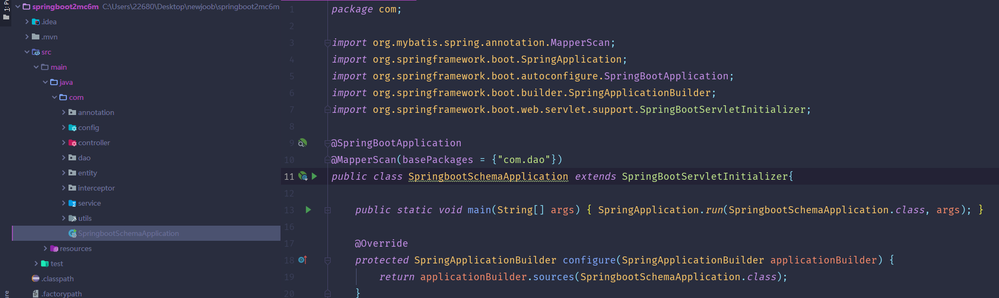
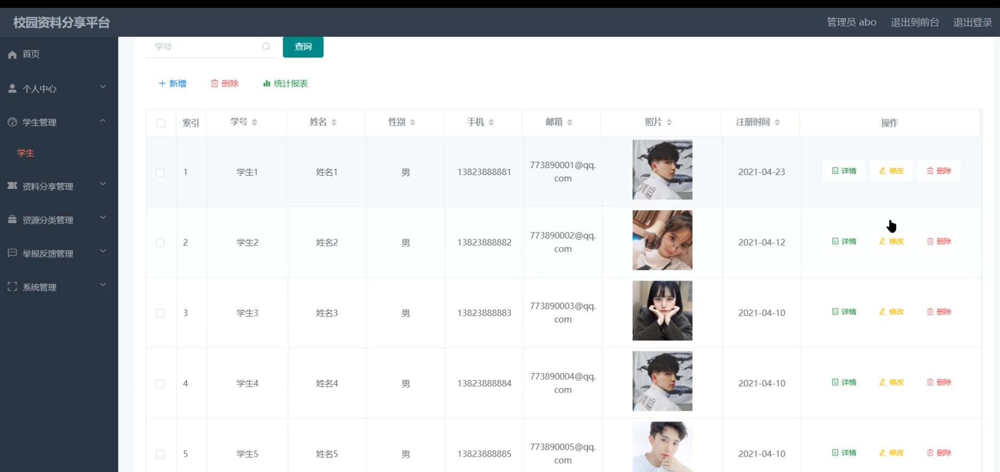
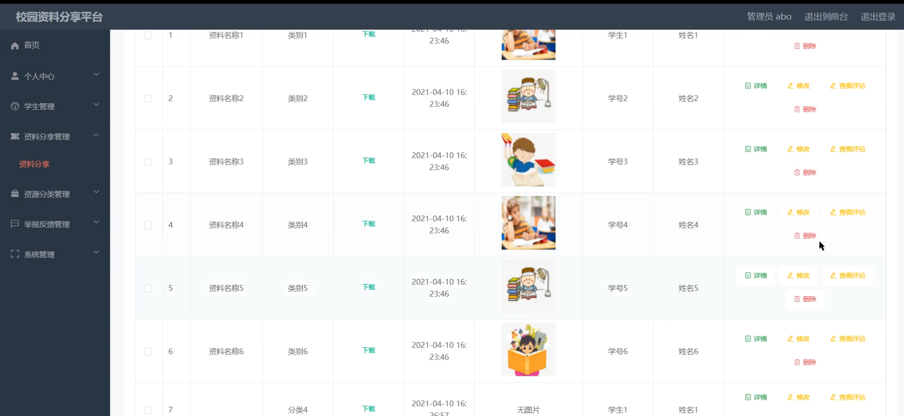
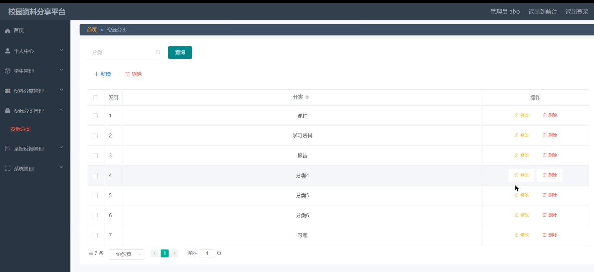
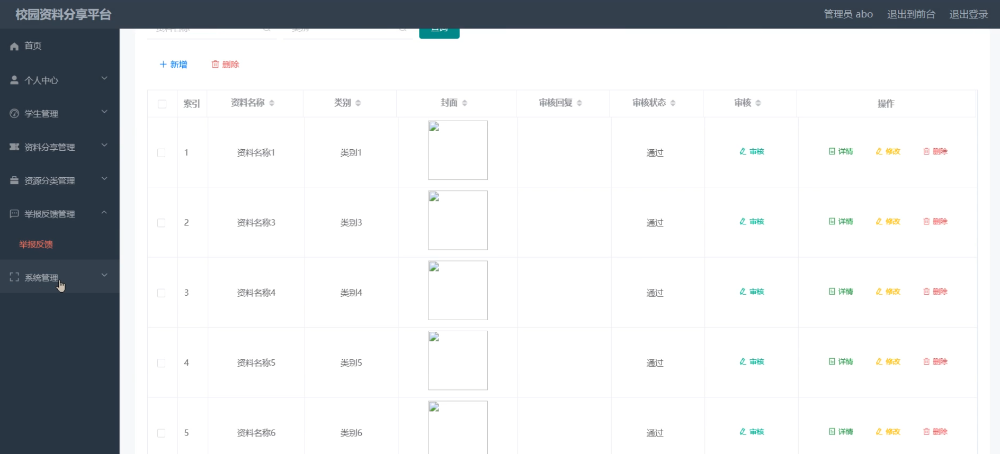
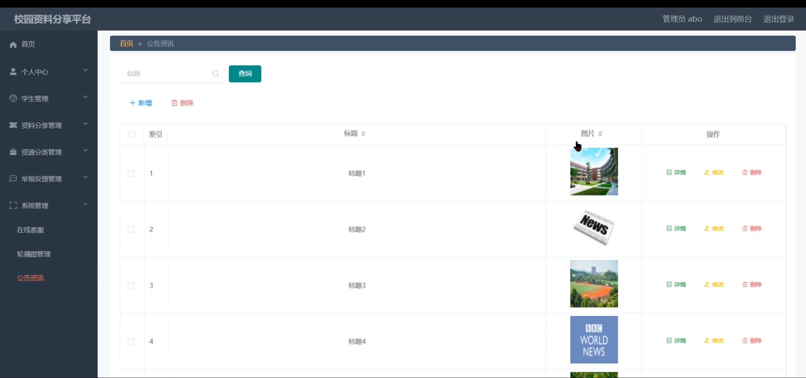
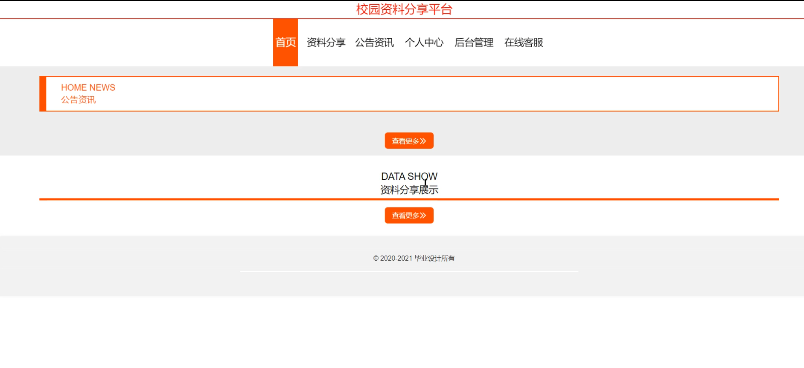
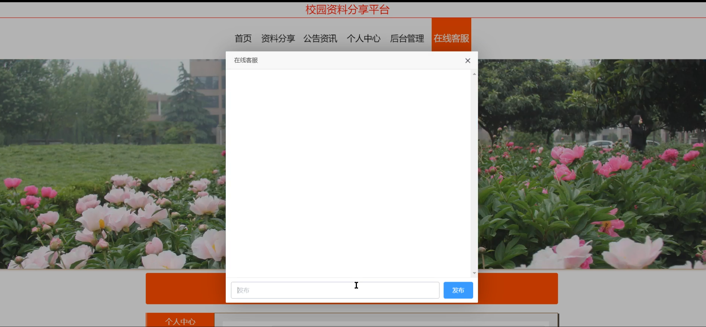
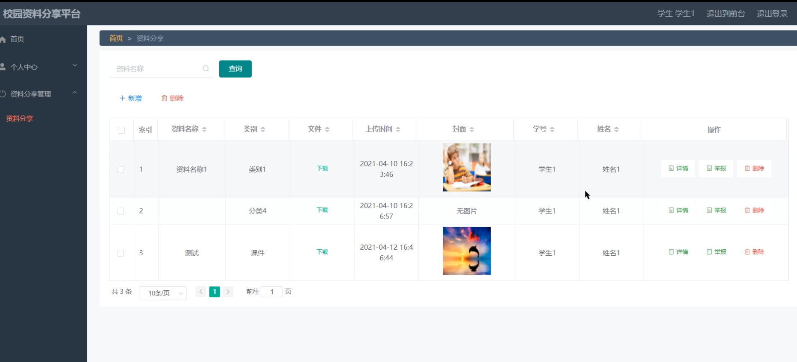

# 基于springboot的校园资料分享平台

#### 介绍

校园资料分享平台是一个基于Spring Boot框架开发的在线资源共享系统，旨在为校园内的学生和管理员提供一个高效、便捷的资源共享与交流平台。该系统支持管理员角色和用户角色，通过不同的功能模块满足不同的使用需求，促进校园内学术与文化资源的流通与共享。

#### 技术栈

后端技术栈：Springboot+Mysql+Maven

前端技术栈：Vue+Html+Css+Javascript+ElementUI

开发工具：Idea+Vscode+Navicate

#### 系统功能介绍

管理员角色功能模块

个人中心：管理员个人信息管理，包括查看、编辑和更新个人信息。  
学生管理：管理学生账号，包括账号的创建、查询、编辑和删除。  
资料分享管理：审核、发布和管理学生分享的资料，确保资料的质量和合规性。  
资源分类管理：设定和修改资源分类，方便用户查找和浏览。  
举报反馈管理：处理用户举报，对违规内容进行相应的处理。  
系统管理：配置系统参数，管理用户权限，确保系统的正常运行。  

2. 用户角色功能模块

资料分享：上传和分享个人或团队的学习资料，供其他用户下载和查看。  
公告资讯：查看平台发布的最新公告和资讯，了解平台动态。  
个人中心：管理个人信息，包括查看、编辑和更新个人信息，以及管理自己分享的资料。  
后台管理（资料分享管理）：用户可以对自己分享的资料进行编辑、删除和下架操作。  
在线客服：提供在线咨询和反馈服务，解答用户疑问，处理用户反馈。  

#### 系统作用

. 对学生的作用

提供丰富的学习资源，帮助学生获取所需资料，提高学习效率。  
促进学生之间的交流和合作，分享学习心得和资料，共同进步。  
培养学生的分享精神，提升自我价值感和成就感。  

2. 对管理员的作用

实现对平台资源的有效管理，确保资源的质量和合规性。  
监控平台运行状况，及时发现和处理问题，确保平台的稳定运行。  
收集用户反馈，不断优化系统功能和服务，提升用户体验。  

#### 系统功能截图

代码结构

数据库表

登录

学生管理

资料分享管理

资源分类

举报反馈管理

系统管理

前台页面首页

在线客服

学生端后台管理

#### 总结

校园资料分享平台是一个功能全面、操作便捷的在线资源共享系统。通过整合校园内的学术和文化资源，该系统为学生和管理员提供了一个高效、便捷的资源共享与交流平台。学生可以通过系统获取丰富的学习资源，提高学习效率；管理员则可以通过系统实现对平台资源的有效管理，确保平台的稳定运行。该系统不仅促进了校园内资源的流通与共享，还培养了学生的分享精神和合作精神，对提升校园整体学习氛围具有积极意义。

#### 使用说明

创建数据库，执行数据库脚本 修改jdbc数据库连接参数 下载安装maven依赖jar 启动idea中的springboot项目

后台地址：http://localhost:8080/springboot2mc6m/admin/dist/index.html

管理员  abo 密码 abo

前台地址：http://localhost:8080/springboot2mc6m/front/index.html

